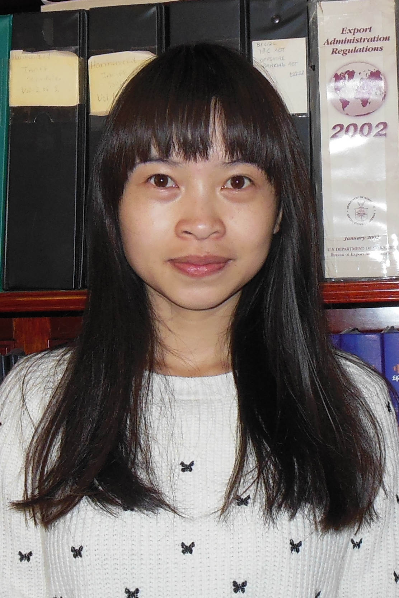

  

Annie has achieved Bachelor’s Degree in Marketing from North China Electric Power University, Beijing, in the year 2009. After graduation she became a sales engineer in E-Sun Technology Co., Ltd and then Kingold Group in north China. During this period she drove sales of electric power communication equipments and real gold, operated and implemented regional market solutions, developed and maintained strong customer relations, conducted contract negotiations and biddings.

In the year 2012, she came to Shenzhen and worked in EVERVUE Asia, a company with branches in Netherlands, U.S.A, Germany and H.K. She gained Accounting Certificate, enlarged company business scope and changed business type, acted as business English interpreter.

Fluent in Mandarin and English, hard-working, good communicate skills, these characters finally gave Annie an opportunity to join in the professional, multinational, and practical-minded team of Sylvester and Associates.

