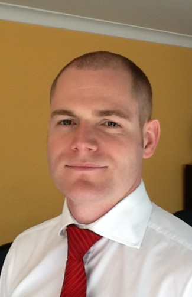

  

Mr Briggs is a soldier turned Independent Financial Advisor (IFA) and is now a Partner and Senior Financial Consultant with the world’s largest independent financial consultancy, the deVere Group www.devere-group.com which has over $8 billion under advice and management and over 65,000 clients globally. 

He has a unique skill-set in that he combines the experience of holistic private wealth management with the practical aspect of ‘trading’ having worked for a proprietary trading firm in the City of London and firmly believes his role is to educate his clients whilst helping them achieve their financial objectives.

Mr Briggs’s main focus within the deVere Group are QROPs (Qualifiying Regulated Overseas Pensions), QNUPs, EURBS, Strategic Portfolio and Fund Management, Tax Efficiency, Lump Sum and Regular Investments, 401ks 402bs and Pensions.

Mr Briggs has developed a stellar reputation within the industry for his service based approach to financial planning as well as his ability to define and manage risk to ensure his clients are positioned to take advantage of opportunities as they present themselves in a constantly changing world.

Having been headhunted to manage the deVere operation here in Shenzhen and the Pearl River Delta generally, following on from successful stints in both his domestic market (UK) and other locations around the globe, Mr Briggs is now also a Research Fellow within Sylvester & Associates to further his education into advanced tax, pensions, investment planning and international investment.
 

